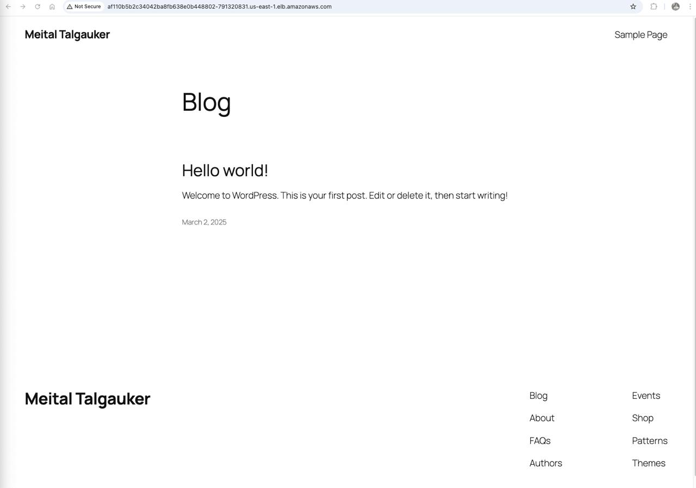
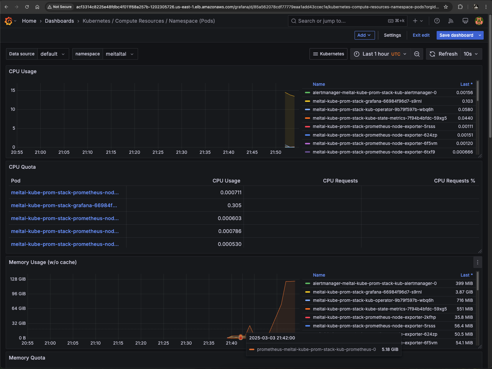

# K8s-WordPress
This repository contains a modular Helm chart (`wordpress-stack`) for deploying WordPress, MySQL, and monitoring tools (Prometheus & Grafana) on a Kubernetes cluster with flexible exposure options (Ingress or ELB).

## Features
- Modular deployment: Enable or disable MySQL, WordPress, and monitoring components.
- Flexible exposure: Choose between Ingress or ELB.
- Persistent storage using AWS EBS.
- Prometheus and Grafana for monitoring.

## Prerequisites
- Kubernetes EKS cluster
- AWS CLI configured
- Helm installed (`v3.x`)
```sh
  curl https://raw.githubusercontent.com/helm/helm/master/scripts/get-helm-3 > get_helm.sh
  chmod 700 get_helm.sh
  ./get_helm.sh
```
- Namespace `meitaltal` created in the cluster:
```sh
  kubectl create namespace meitaltal
```
- ECR secret for pulling images:
```sh
  kubectl create secret docker-registry ecr-secret \
  --docker-server=992382545251.dkr.ecr.us-east-1.amazonaws.com \
  --docker-username=AWS \
  --docker-password=$(aws ecr get-login-password --region us-east-1) \
  --namespace meitaltal
```

## Clone the Repository
```sh
  git clone https://github.com/MeitalTal/K8s-WordPress.git
  cd K8s-WordPress/wordpress-stack
```

## Installation with Helm

1. Update Dependencies: The chart relies on external Helm charts (ingress-nginx and kube-prometheus-stack). Fetch them with:
```sh
  helm dependency update
```

2. Deploy the Chart:
   - With Ingress:
```sh
  helm install wordpress-stack . -n meitaltal --set global.exposure=ingress
```
- This deploys WordPress and Grafana exposed via an NGINX Ingress Controller.

- With ELB:
```sh
  helm install wordpress-stack . -n meitaltal --set global.exposure=elb
```
- This deploys WordPress and Grafana exposed via AWS LoadBalancers.

3. Verify the Deployment:
   - For Ingress:
```sh
     kubectl get ingress -n meitaltal
```
Look for the ADDRESS column to find the Ingress URL. Access WordPress and Grafana via the specified host (e.g., a8343f1c6552d4e7ea28b690b46b3f49-208218308.us-east-1.elb.amazonaws.com).


- For ELB:
```sh
     kubectl get svc -n meitaltal
```
Look for the EXTERNAL-IP of the LoadBalancer services (wordpress-service and grafana-lb-service) to access them directly.


### Manual Installation with YAML Files
Install NGINX Ingress Controller: (Optional)
```sh
  helm repo add ingress-nginx https://kubernetes.github.io/ingress-nginx
  helm repo update
  helm install meitaltal-ingress ingress-nginx/ingress-nginx --namespace meitaltal  --set controller.ingressClassResource.name=meitaltal
```
Apply the yaml files:
```sh
  kubectl apply -f manifests/mysql-secret.yaml
  kubectl apply -f manifests/mysql-statefulset.yaml
  kubectl apply -f manifests/mysql-pv-pvc.yaml
  kubectl apply -f manifests/mysql-service.yaml 
  kubectl apply -f manifests/wordpress-deployment.yaml
  kubectl apply -f manifests/wordpress-pv-pvc.yaml
  kubectl apply -f manifests/wordpress-ingress.yaml        # if you're using ingress
  kubectl apply -f manifests/wordpress-service.yaml        # if you're using ELB, change type to ClusterIp
```
Install kube-prom-stack:
```sh
  helm repo add prometheus-community https://prometheus-community.github.io/helm-charts 
  helm repo update
  helm install meitaltal-kube-prom-stack prometheus-community/kube-prometheus-stack --namespace meitaltal 
  kubectl apply -f manifests/kube-prom-stack-grafana.yaml # if you want to access grafana via ELB 
```

## Access
- WordPress: Use the Ingress host or ELB EXTERNAL-IP.
- Grafana:
  - With Ingress: <Ingress-host>/grafana
  - With ELB: Use the EXTERNAL-IP of grafana-lb-service on port 3000.
  - Default Credentials: Username: admin, Password: prom-operator

## Grafana Dashboards
1. Log in to Grafana.
2. Navigate to the "+" icon on the left-hand menu, then click "Import".
3. Import the file: Kubernetes _ Compute Resources _ Namespace (Pods).json.

## Demo




# ⚙️ Configuration 
Customize the deployment by editing values.yaml or using --set flags:
- Enable/disable components:
```sh
  helm install wordpress-stack . -n meitaltal --set mysql.enabled=false --set global.exposure=elb
```
- Adjust Replica Count for WordPress:
```sh
  helm install wordpress-stack . -n meitaltal --set wordpress.replicaCount=3
```
- Customize Storage Class
  Use a different storage class (e.g., for a custom EBS setup):
```sh
  helm install wordpress-stack . -n meitaltal --set global.storageClassName=meitaltal-ebs
```
- Change namespace, storage class, or other settings in values.yaml.

- Example Full Configuration:
```sh
  helm install wordpress-stack . -n meitaltal \
  --set global.exposure=elb \
  --set mysql.enabled=true \
  --set wordpress.enabled=true \
  --set wordpress.replicaCount=2 \
  --set monitoring.enabled=true \
  --set global.storageClassName=ebs-custom \
  --set wordpress.storageSize=5Gi
```

# Uninstall 
To remove the deployment:
```sh
  helm uninstall wordpress-stack -n meitaltal
```

# 🔧 Troubleshooting
1. Prometheus is configured to scrape metrics from Node Exporter on port 9100.
If you encounter issues with Prometheus not collecting metrics, follow these steps:
Check if Prometheus is running:
```sh
kubectl get pods -n meitaltal | grep prometheus
```
If the pod is not running, check logs:
```sh
kubectl logs <prometheus-pod-name> -n meitaltal
```
Edit the DaemonSet (if necessary):
If there is a port conflict, update the kube-prometheus-stack DaemonSet:
```sh
kubectl edit daemonset.apps/meitaltal-kube-prom-stack-prometheus-node-exporter
```
Find and modify 9100 port, save and exit the editor.
Restart Prometheus Components:
```sh
kubectl rollout restart daemonset meitaltal-kube-prom-stack-prometheus-node-exporter -n meitaltal
```
2. Grafana Access Issues: Update the ConfigMap if the UI isn't accessible:
 ```sh
kubectl edit cm meitaltal-kube-prom-stack-grafana
```
Under [Server], add the following:
 ```sh
serve_from_sub_path = true
root_url = %(protocol)s://%(domain)s/grafana/
```
Restart Grafana:
 ```sh
kubectl rollout restart deployment meitaltal-kube-prom-stack-grafana 
```

